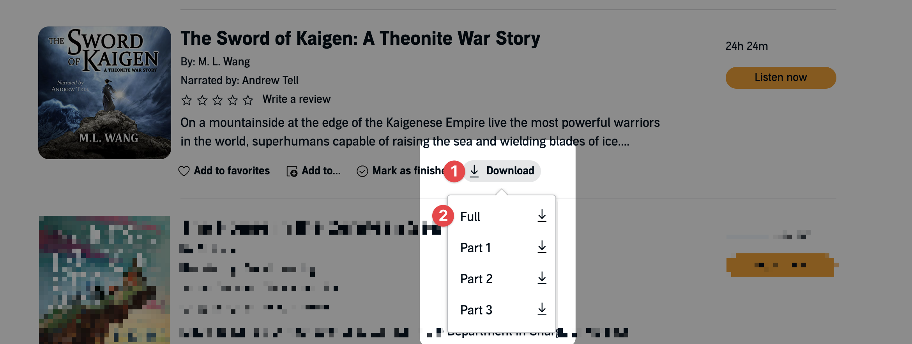

# Audible scripts

Get your Audible books in MP4 for usage with something like [BookPlayer](https://github.com/TortugaPower/BookPlayer).

Audible encrypts files on your device, you own the rights to the content when you purchase the book ([see this ruling](https://www.eff.org/files/2014/12/10/gov.uscourts.nysd_.425052.82.0.pdf)).

To get a book, it requires a few steps:

1. recover your "activation_bytes" hash for your Audible account, which are used as a key to encrypt your files
2. crack your hash using Audible specific rainbow tables, so you can then decrypt your Audible files with it
3. use your the cracked hash to convert files from the Audible `.aax` format into `.mp4`

## Prerequisites

> These steps are catered to MacOS, but you can find Windows and Linux steps below that aren't vetted.

Download softwares you'll need, ffmpeg for converting files, wine for running the Windows binaries, and the git repo for cloning needed rainbow table files (`*.rtc`).

```
brew install ffmpeg
brew install wine
git clone https://github.com/gillkyle/audible-unlock.git
```

Download an Audible file from the Audible library website. You need a `.aax` file from your account that will have your associated `activation_bytes` hash.



## 1. Recover your "activation_bytes"

You need to recover or retrieve your "activation_bytes", which only needs to be done a single time for as many books as you'd like to convert. This single
"activation_bytes" value will work for all your .aax files as it's unique for your account.

```
ffprobe <the-name-of-your-aax-file>.aax
```

Replace `<the-name-of-your-aax-file>` with the name of the file, for example `harry-potter.aax`.

This command will output something like:

```
[mov,mp4,m4a,3gp,3g2,mj2 @ 0x1dde580] [aax] file checksum == 99433dc5765d722b6f19d4c9a02d1511ec278309
[mov,mp4,m4a,3gp,3g2,mj2 @ 0x1dde580] [aax] activation_bytes option is missing!
... many more lines of output ...
```

Find the line that says `[aax] file checksum == <activation_bytes_hash>` and copy the hash. In this case it's `99433dc5765d722b6f19d4c9a02d1511ec278309`.

Copy the hash for use in the next step.

## 2. Crack your "activation_bytes"

Then you need to crack these activation bytes to get your unique hash key:

In the root of this repo, run:

```
wine ./run/rcrack.exe . -h <your_activation_bytes_hash>
```

Replace `<your_activation_bytes_hash>` with the hash you copied from the previous step. In the example above it would look like:

```
wine ./run/rcrack.exe . -h 99433dc5765d722b6f19d4c9a02d1511ec278309
```

You should then see output like this:

```
... more output files above ...
disk: .\audible_byte#4-4_9_10000x791022_0.rtc: 5537154 bytes read
disk: finished reading all files
plaintext of 433dc5765d722b6f19d4c9a02d1511ec278309e5 is \xe7\x02\x11#

statistics
----------------------------------------------------------------
plaintext found:                             1 of 1
total time:                                  3.25 s
time of chain traverse:                      2.84 s
time of alarm check:                         0.25 s
time of disk read:                           0.02 s
hash & reduce calculation of chain traverse: 49990000
hash & reduce calculation of alarm check:    3369524
number of alarm:                             2560
performance of chain traverse:               17.57 million/s
performance of alarm check:                  13.70 million/s

result
----------------------------------------------------------------
433dc5765d722b6f19d4c9a02d1511ec278309e5  \xe7\x02\x11#  hex:e7021456
```

In the example above, the cracked hash is `e7021456`. Copy this value for use in converting your Audible files. You'll likely want to store this in something like a `.secrets` file for future reference.

## 3. Convert your Audible files

Now you're ready to convert your Audible files into MP4. Use your cracked hash value in an ffmpeg command to decrypt and convert the file into a more universal format like .mp4.

Point ffmpeg at the downloaded `.aax` file and it will output a `.mp4` file.

```
ffmpeg -activation_bytes e7021456 -i "harry-potter.aax" -vn -c:a copy "harry-potter.mp4"
```

The flags in this command are:

- `-activation_bytes e7021456` uses your activation bytes hash (replace the value with your own) to decrypt the file
- `-i "harry-potter.aax"` points to the file you want to decrypt and convert
- `-vn` tells ffmpeg to ignore any video in the file
- `-c:a copy` tells ffmpeg to copy the audio only, avoiding re-encoding
- `"harry-potter.mp4"` is the name of the file to output

You can replace the `-c:a copy` with other audio formats like `-c:a libmp3lame -q:a 2` to convert to MP3 at a lower quality setting. You can also run this command again on a different file with your same hash to convert other files.

You're done! 🎊

## Recommandations

In the iOS ecosystem, you can use great open-source apps like [BookPlayer](https://github.com/TortugaPower/BookPlayer) to manage your audiobooks and listen to them.

## References

See http://project-rainbowcrack.com/alglib.htm for additional details about the code in this project.

## Notes

This is a fork of the https://github.com/inAudible-NG/tables repo, synced to my own profile so where I can store some of my own secrets files, and update steps to be MacOS friendly as it doesn't accept contributions.

Please use responsibly, and only on content you have purchased and are legally authorized to access and backup.
